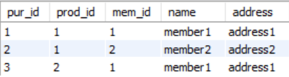

## Concept

It only shows data which exist both in the two tables.

&nbsp;

## Order of Rows

In MySQL, it follows the order of the child table.

&nbsp;

## Example

From now on, let me join 'member' table and 'purchase' table.

&nbsp;

## When 'member' Comes after 'FROM'

```sql
SELECT purchase.id AS pur_id, prod_id, mem_id, member.name, member.address
	FROM member
		INNER JOIN purchase
			ON purchase.mem_id = member.id;
```



&nbsp;

## When 'purchase' Comes after 'FROM'

```sql
SELECT purchase.id AS pur_id, prod_id, mem_id, member.name, member.address
	FROM purchase
		INNER JOIN member
			ON purchase.mem_id = member.id;
```

The result is same as [When 'member' Comes after 'FROM'].
