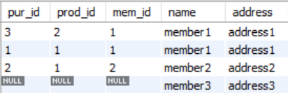
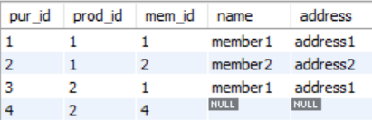

## Concept

The table after 'FROM' is the standard. So, if there is no data about the data in the table after 'FROM', it uses one row and fill parts where no data exist as 'NULL'.

&nbsp;

## Order of Rows

In MySQL, it follows the order of the table after 'FROM'.

&nbsp;

## Example

From now on, let me join 'member' table and 'purchase' table.

&nbsp;

## When 'member' Comes after 'FROM'

```sql
SELECT purchase.id AS pur_id, prod_id, mem_id, member.name, member.address
	FROM member
		LEFT JOIN purchase
			ON purchase.mem_id = member.id;
```



The result is same as [RIGHT.md > When 'member' Comes after 'RIGHT JOIN']

&nbsp;

## When 'purchase' Comes after 'FROM'

```sql
SELECT purchase.id AS pur_id, prod_id, mem_id, member.name, member.address
	FROM purchase
		LEFT JOIN member
			ON purchase.mem_id = member.id;
```



The result is same as [RIGHT.md > When 'purchase' Comes after 'RIGHT JOIN']
