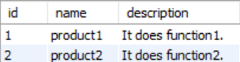
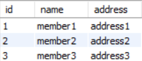
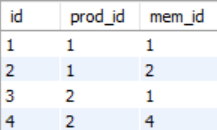

## Objective

This repository will present how SQL JOIN works.

## Type of SQL I Used

I used MySQL.

## Example I Will Use

Please execute 'market.sql'.

The tables look like these.

### product

### member

### purchase

## Order

### First

basic.md

### Second

INNER.md > LEFT.md > RIGHT.md

### Third

more_than_two_tables.md
